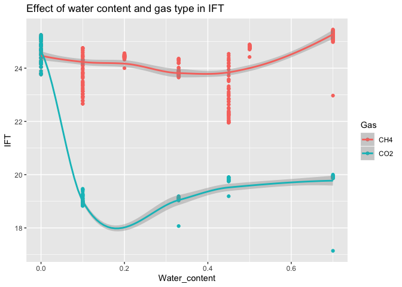

Modeling IFT and Voulme Expansion
================

``` r
# let's us read the data set
ift_data <- read_excel(path = "data/ift_data.xlsx")
ift_data
```

    ## # A tibble: 561 x 5
    ##    Gas   Water_content time_minutes volume_ratio   IFT
    ##    <chr>         <dbl>        <dbl>        <dbl> <dbl>
    ##  1 CH4               0      0.00005         1     25.1
    ##  2 CH4               0     15.0             1.00  25.1
    ##  3 CH4               0     30               1.01  25.2
    ##  4 CH4               0     45               1.01  25.2
    ##  5 CH4               0     60               1.01  25.2
    ##  6 CH4               0     75               1.01  25.1
    ##  7 CH4               0     90               1.01  25.2
    ##  8 CH4               0    105               1.00  25.2
    ##  9 CH4               0    120               1.00  25.1
    ## 10 CH4               0    135               1     25.1
    ## # … with 551 more rows

``` r
# visualizing the IFT
ggplot(ift_data, aes(Water_content, IFT,color = Gas) ) +
  geom_point() +
    ggtitle("Effect of water content and type of Gas in IFT")+

  stat_smooth()
```

<!-- -->

``` r
# visualizing the volume expansion
ggplot(ift_data, aes(Water_content, volume_ratio
                     ,color = Gas),
       ) +
  ggtitle("Effect of water content and gas type in Volume Ratio")+
  geom_point() +
  stat_smooth()
```

<!-- -->

``` r
# let's build a linear model to predict the IFT
model_ift <- lm(scale(IFT) ~ scale(Water_content)*scale(time_minutes), data = ift_data)
model_vol <- lm(volume_ratio ~ Water_content*time_minutes, data = ift_data)
```

``` r
# IFT model
tidy(model_ift)
```

    ## # A tibble: 4 x 5
    ##   term                                 estimate std.error statistic      p.value
    ##   <chr>                                   <dbl>     <dbl>     <dbl>        <dbl>
    ## 1 (Intercept)                            0.0204    0.0408     0.500      6.18e-1
    ## 2 scale(Water_content)                   0.109     0.0408     2.67       7.84e-3
    ## 3 scale(time_minutes)                    0.0738    0.0408     1.81       7.13e-2
    ## 4 scale(Water_content):scale(time_min…   0.248     0.0406     6.11       1.85e-9

``` r
# Volume Expansion model
tidy(model_vol)
```

    ## # A tibble: 4 x 5
    ##   term                         estimate  std.error statistic  p.value
    ##   <chr>                           <dbl>      <dbl>     <dbl>    <dbl>
    ## 1 (Intercept)                 1.01      0.00370       273.   0.      
    ## 2 Water_content              -0.0591    0.00952        -6.21 1.04e- 9
    ## 3 time_minutes               -0.0000134 0.00000711     -1.88 6.04e- 2
    ## 4 Water_content:time_minutes -0.000159  0.0000189      -8.42 3.15e-16
